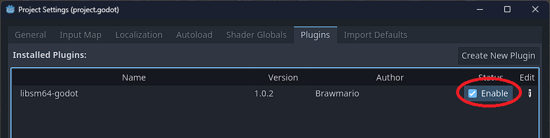
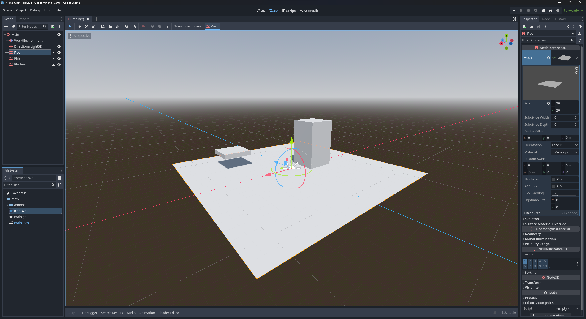
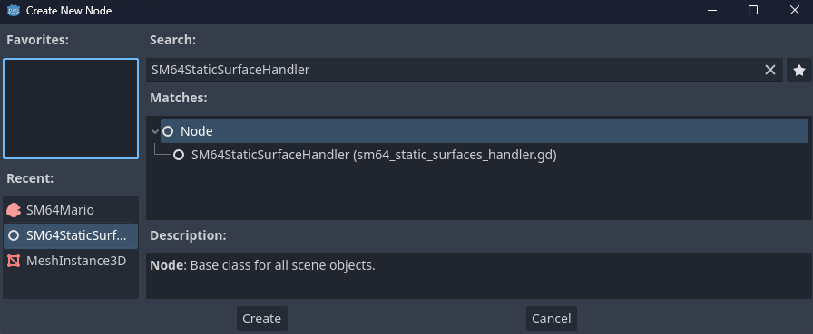
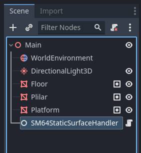
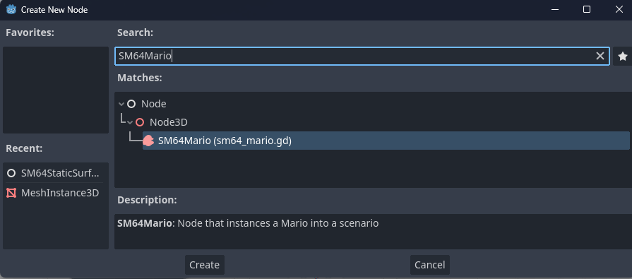
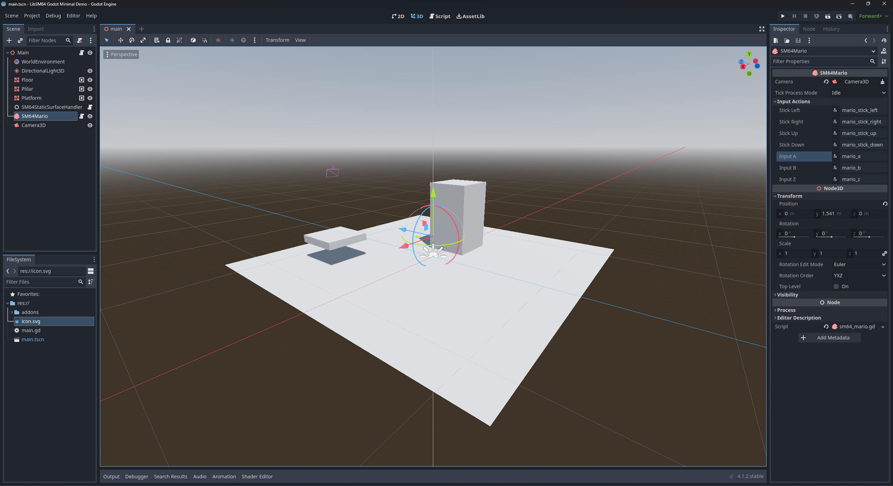
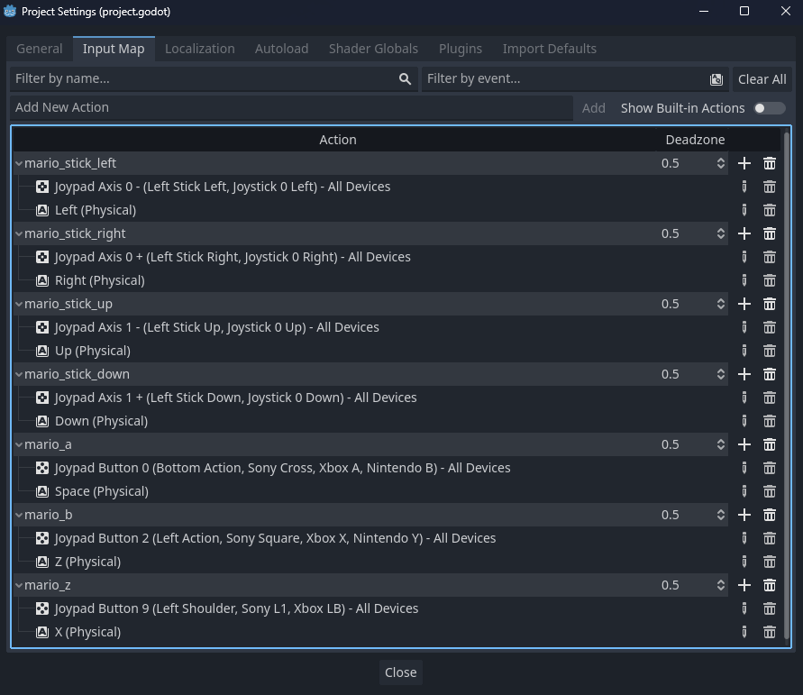
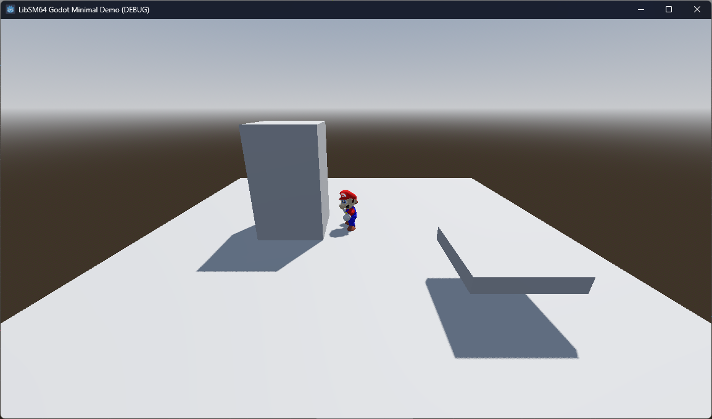

# Libsm64 Godot addon manual

NOTE: the node names in the screenshots in this manual are outdated, they should be prefixed with `LibSM64` instead of `SM64`.

## Installation

You can get the addon from the [Godot Asset Library](https://godotengine.org/asset-library/asset/3653) or from the [GitHub releases page](https://github.com/Brawmario/libsm64-godot/releases). You should have the `addons/libsm64_godot` folder in your project folder.

If done correctly, the addon should show up under `Project Settings > Plugins`. Enable the addon on this same screen.



Note: You might get a `Error loading extension: res://addons/libsm64_godot/extension/libsm64.gd.gdextension` message. Try reloading the project or re-adding the addon, this error seems inconsistent.

## How to setup basic use

### Providing the ROM

In order to use libsm64-godot, a ROM of Super Mario 64 (USA) is necessary (for legal reasons, steps to get a ROM will not be disclosed). Make sure the ROM file has the following SHA256 hash:

>17ce077343c6133f8c9f2d6d6d9a4ab62c8cd2aa57c40aea1f490b4c8bb21d91

The path to this ROM file needs to be provided to the `LibSM64Global` static class when calling `LibSM64Global.load_rom_filepath(filepath: String)` before you can call the `LibSM64Global.init()` method. If the SHA256 doesn't match, it will be rejected and the addon will fail to initialize.

The ROM file does not need to be included with a project that uses this addon and can be dynamically sourced from the user at runtime in order to avoid the unauthorized distribution of copyrighted material. Check the `main` scene in the included demo project on this repository for an example on how to request a filepath from the user at runtime.

### Setting up a scene

For this example I will setup a basic 3D scene with meshses that will serve as static collision surfaces. If you are trying to put Mario in a already existing scene you can reuse the already existing meshes, but it is best to use the simplest meshses possible for collision (you can make the meshes invisible if you're only creating them to establish collision).

The scene for this example is this:



The floor a is 20 meters by 20 meters plane and the pillar is a 5 meters tall rectangular prism.

### Static Surfaces

In order to allow the addon to use the meshes as collision, you'll need to add an `LibSM64StaticSurfaceHandler` node to the scene via the Create New Node dialog. Then, you'll need to add all the meshes that will serve as the Static Surfaces of the world to the node group specified by the `static_surfaces_group` field of the `LibSM64StaticSurfaceHandler` node (by default the group name will be `libsm64_static_surfaces`, you shouldn't really need to change this).





### SM64Mario node

Create a `LibSM64Mario` node and add it to the scene. You'll also want to add a `Camera3D` node to the scene at this point. The camera will be static for this demo.



Position the camera appropriately and position the `LibSM64Mario` node a little bit above the plane. Inspect the `LibSM64Mario` node, click on the `Camera` property and pick the `Camera3D` in the scene tree.



Take note of the properties under the `Mario Inputs Actions` export group. These are the action names used by the node in order to control Mario. Either change these action names to other names already in the project's Input Map (such as the `ui_*` action names) or create these action names in the project's Input Map and bind them to the appropriate axes/buttons/keys.



### Final scene setup - basic script

Add a new script on the root node. The following script snippet is a simple example on how to initialize the `libsm64` world and how to initialize the `LibSM64Mario` node.

```gdscript
extends Node3D


@onready var libsm_64_mario: LibSM64Mario = $LibSM64Mario
@onready var libsm_64_static_surface_handler: LibSM64StaticSurfacesHandler = $LibSM64StaticSurfacesHandler


func _ready() -> void:
	# Load the ROM file to `LibSM64Global`.
	# Avoid hardcoding this parameter, you should get this path on runtime.
	# If the SHA-256 hash of the ROM file does not match the expected hash, loading will fail.
	var rom_filepath := "/path/to/rom/file.z64"
	if not LibSM64Global.load_rom_file(rom_filepath):
		push_error("Failed to load SM64 ROM file.")
		return

	# Init the `libsm64` world.
	LibSM64Global.init()

	# Init the static surfaces (make sure the relevant MeshIntance3D nodes are ready and in the appropriate group).
	libsm_64_static_surface_handler.load_static_surfaces()

	# Initialize the SM64Mario node.
	# both the `libsm64` world and the Static Surfaces must be already initialized without errors.
	libsm_64_mario.create()


func _on_tree_exiting() -> void:
	# Clean up the `libsm64` world when the scene is freed.
	libsm_64_mario.delete()
	LibSM64Global.terminate()
```

If everything goes correctly, you should be able to run this scene and get it all to work.



## Futher setup

### Surface Objects

Static surfaces are loaded once with `LibSM64StaticSurfacesHandler.load_static_surfaces()` and cannot move afterwards (calling it again overwrites the whole world). For anything that moves — platforms, elevators, rotating bridges, doors — use surface objects.

1. Add a `LibSM64SurfaceObjectsHandler` node to the scene.
2. Add each moving `MeshInstance3D` / `CollisionObject3D` / `CollisionShape3D` to the `libsm64_surface_objects` group (or the custom group set in `surface_objects_group`).
3. After `LibSM64Global.init()`, call `load_all_surface_objects()` (or `load_surface_object(node)` for a single node). The handler extracts the mesh faces **in local space** and registers the object with its current `global_transform` (position + rotation quaternion).
4. Every physics tick (`LibSM64.tick_delta_time`, i.e. 1/30 s) the handler calls `LibSM64.surface_object_move(id, position, rotation)` automatically in `_physics_process()`, so just move the Godot node normally (via `AnimationPlayer`, code, etc.).
5. When a node leaves the tree / is freed, its surface object is deleted automatically (`tree_exiting`). You can also call `delete_surface_object(node)` or `delete_all_surface_objects()` manually.

Supported nodes are the same as for static surfaces (see `LibSM64SurfaceHandlerBase.get_faces_from_node()`): `MeshInstance3D`, `CollisionObject3D` (iterates its `CollisionShape3D` children) and `CollisionShape3D` with `BoxShape3D` or `ConcavePolygonShape3D`. Other shape types log an error and are skipped. Keep moving meshes as simple as possible.

Example:

```gdscript
@onready var surface_objects_handler: LibSM64SurfaceObjectsHandler = $LibSM64SurfaceObjectsHandler

func _ready() -> void:
	LibSM64Global.load_rom_file(rom_filepath)
	LibSM64Global.init()
	$LibSM64StaticSurfacesHandler.load_static_surfaces()
	surface_objects_handler.load_all_surface_objects()
```

### Surface properties

Both handlers look for an optional `LibSM64SurfacePropertiesComponent` child on each surface node (`LibSM64SurfaceHandlerBase.find_surface_properties()`). If present, its `LibSM64SurfaceProperties` resource is passed per-triangle via `add_triangle_with_properties()`; otherwise `SURFACE_DEFAULT` / `TERRAIN_GRASS` is used.

Add it like this: select the surface `MeshInstance3D`, add a child node of type `LibSM64SurfacePropertiesComponent`, create a new `LibSM64SurfaceProperties` resource in its `surface_properties` export and set:

- `surface_type` (`LibSM64.SurfaceType`): physics behaviour. Useful values are `SURFACE_DEFAULT`, `SURFACE_NOT_SLIPPERY` (climbable), `SURFACE_SLIPPERY`, `SURFACE_VERY_SLIPPERY` / `SURFACE_ICE` (slides), `SURFACE_HARD` family (always fall damage), `SURFACE_BURNING` (lava damage), `SURFACE_DEATH_PLANE` (kills Mario), `SURFACE_WATER` / `SURFACE_FLOWING_WATER`, `SURFACE_HANGABLE` (ceilings Mario can hang from), `SURFACE_SLOW`, quicksand variants (`SURFACE_SHALLOW_QUICKSAND`, `SURFACE_DEEP_QUICKSAND`, …). Camera/painting/warp types exist but most have no effect outside the original SM64 levels.
- `terrain_type` (`LibSM64.TerrainType`): mostly sound/particles — `TERRAIN_GRASS`, `TERRAIN_STONE`, `TERRAIN_SNOW`, `TERRAIN_SAND`, `TERRAIN_SPOOKY`, `TERRAIN_WATER`, `TERRAIN_SLIDE`.
- `force`: extra parameter used by some surfaces (e.g. wind `SURFACE_HORIZONTAL_WIND` / `SURFACE_VERTICAL_WIND`, flowing water). Leave at `0` unless you know the surface needs it.

The full lists live in `extension/src/libsm64.hpp` (`SurfaceType`, `TerrainType`, from `surface_terrains.h`).

## Quirks

### Have a big plane below your world added to the Static Surfaces

Static surfaces delimit the boundaries of the `libsm64` world in the XZ plane: Mario can only exist above them and hits "invisible walls" at their edges (see the warning on `LibSM64StaticSurfacesHandler.load_static_surfaces()`). If Mario walks/falls past the edge of your level geometry, he falls forever or gets stuck outside the world.

Fix: always add a large, simple plane (e.g. 200×200 m) a few meters below the lowest point of the level to the `libsm64_static_surfaces` group. For RL scenes this doubles as a fail-safe floor so episodes can detect "fell" via height threshold and reset instead of hanging. Optionally give it `SURFACE_DEATH_PLANE` so falls kill Mario instead of leaving him stranded.

### Low poly mesh (make collion specific meshes)

Every triangle of every surface mesh is copied into `libsm64` (`get_faces()` → `LibSM64SurfaceArray.add_triangle()`), and collision runs at 30 Hz tick rate. High-poly visual meshes therefore tank performance and produce jittery collision.

Best practice: build separate, invisible, low-poly collision meshes (boxes, simple concave shapes, decimated planes) and put only those in the `libsm64_static_surfaces` / `libsm64_surface_objects` groups. Reuse Godot `CollisionShape3D` boxes where possible — `LibSM64SurfaceHandlerBase` natively supports `BoxShape3D` and `ConcavePolygonShape3D`. Keep visual meshes out of the collision groups entirely, and prefer a handful of large triangles over hundreds of small ones.
